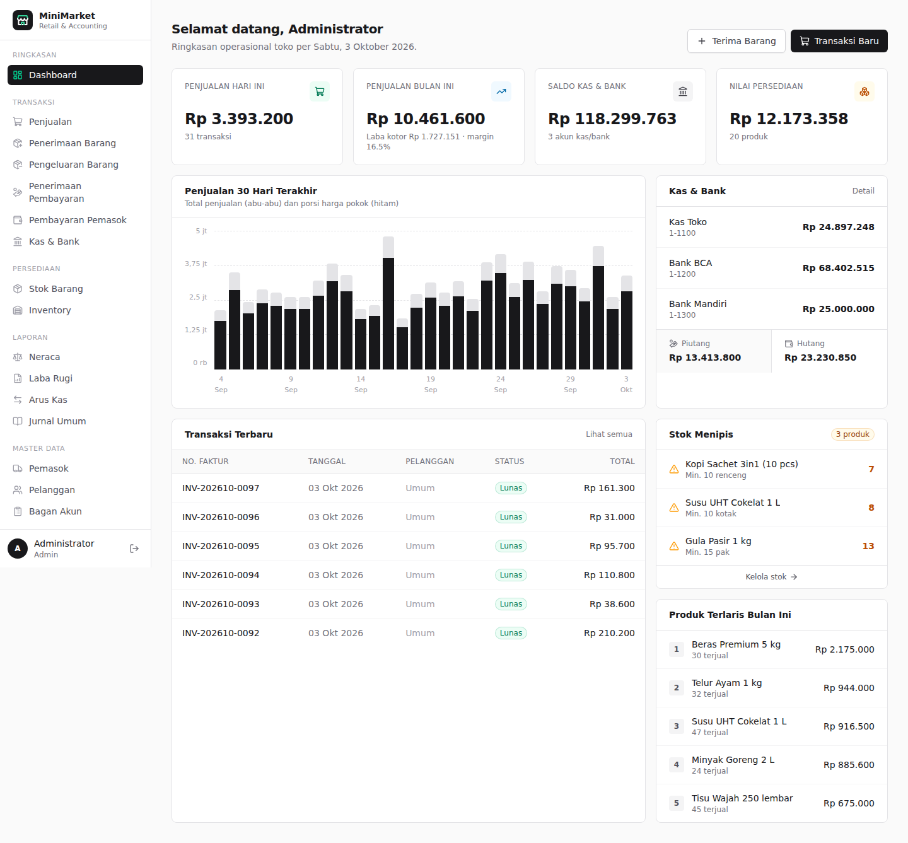
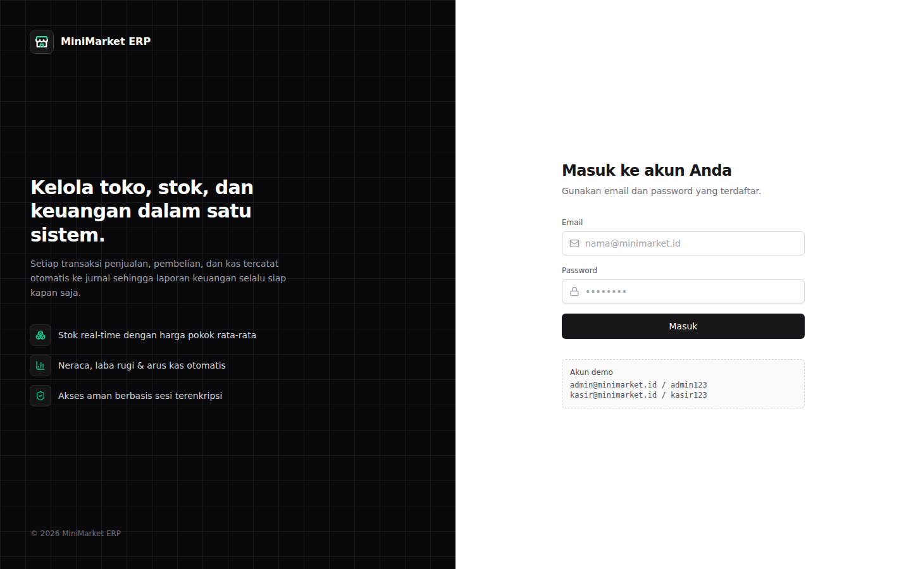
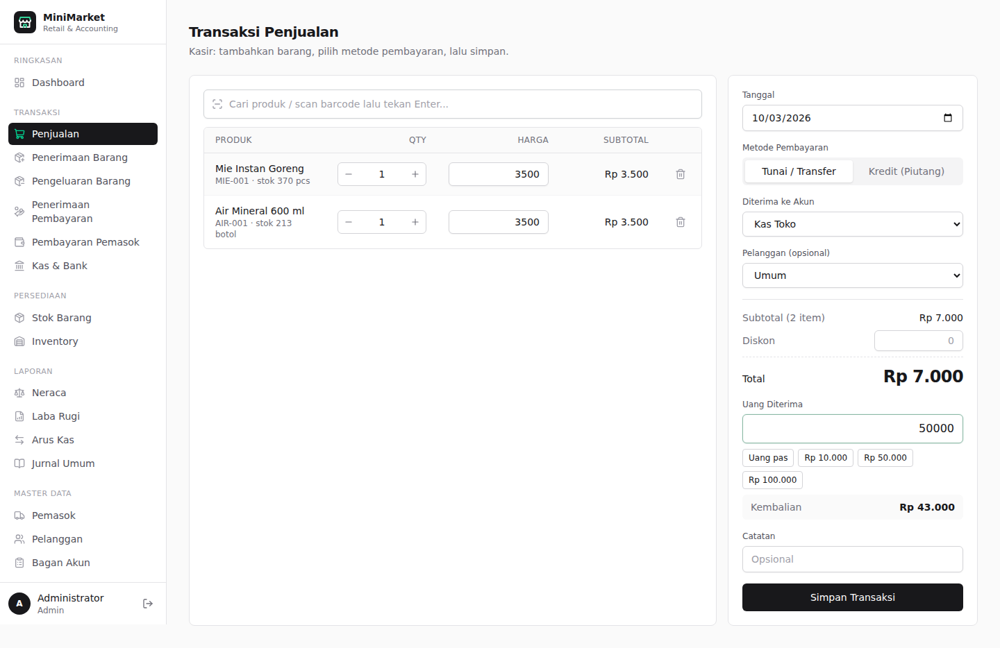
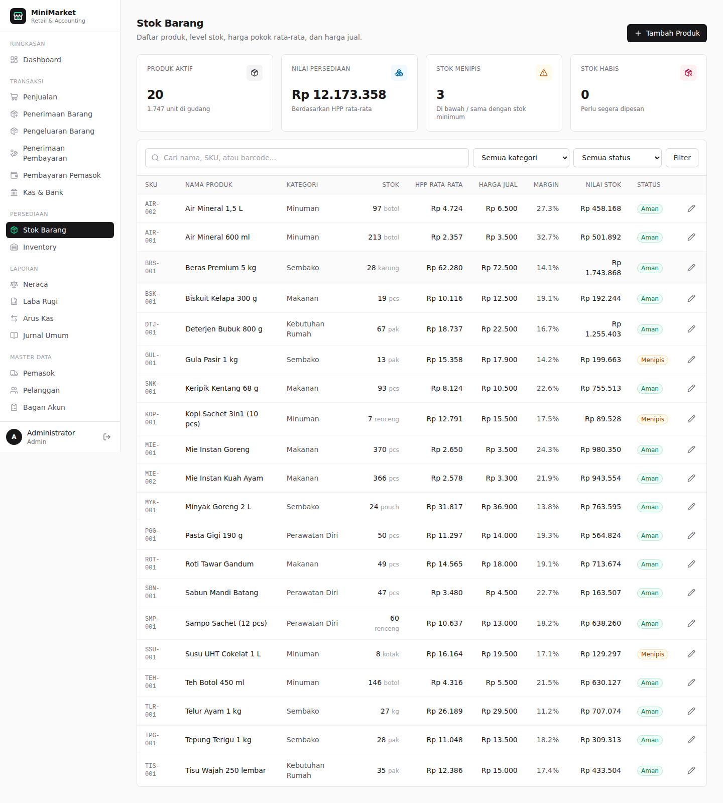
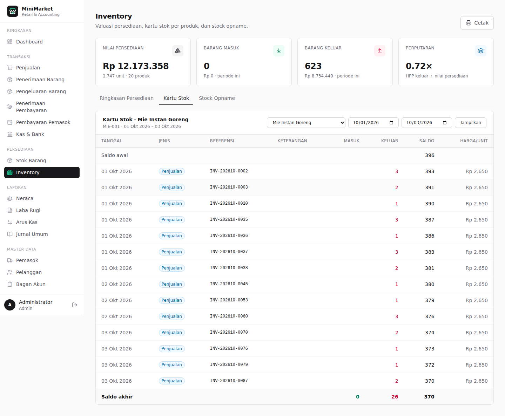
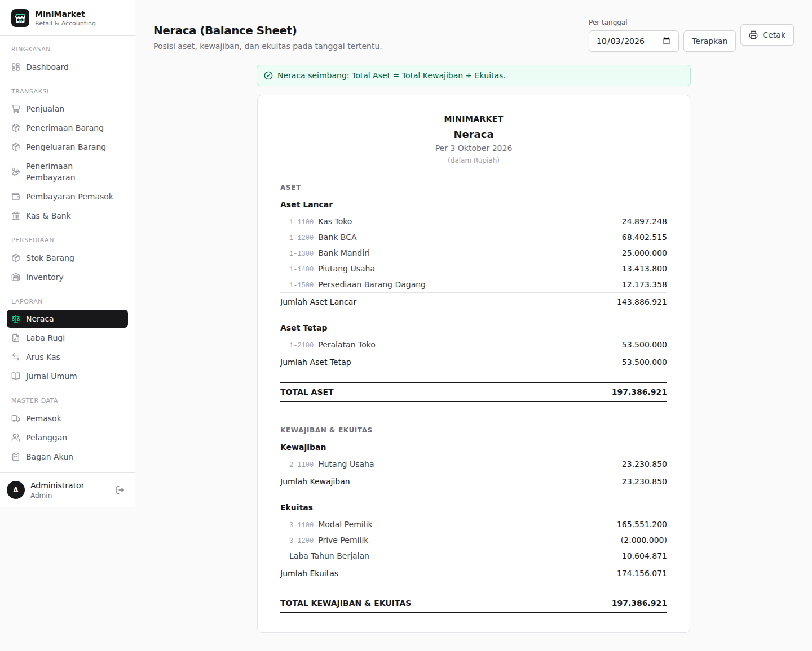
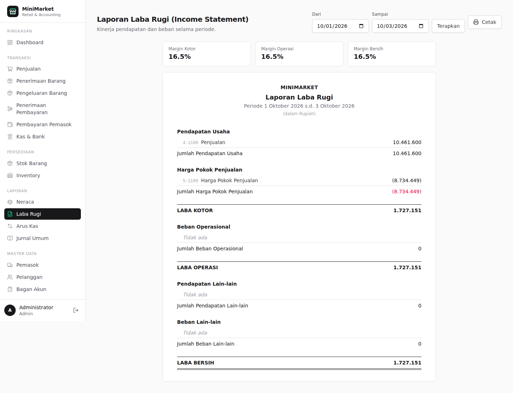
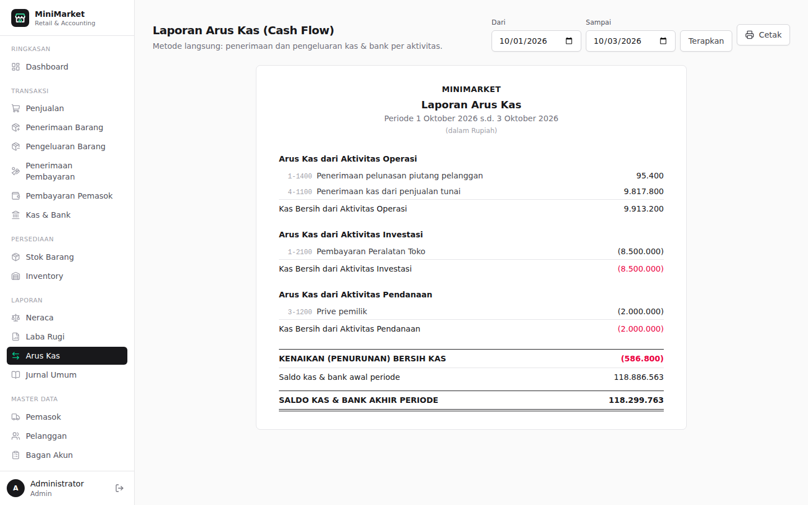
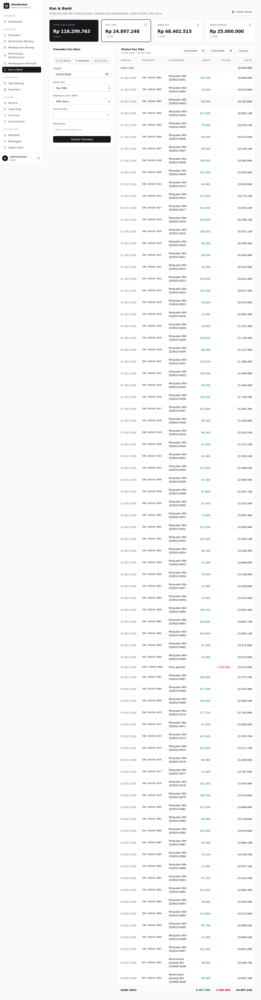

# MiniMarket ERP

Aplikasi manajemen minimarket berbasis web: kasir/penjualan, stok & inventory, kas & bank, hutang-piutang, sampai laporan keuangan (Neraca, Laba Rugi, Arus Kas). Setiap transaksi otomatis membuat **jurnal double-entry**, jadi laporan keuangan selalu sesuai dengan transaksi operasional.



## Teknologi

| Lapisan | Teknologi |
| --- | --- |
| Framework | [Next.js 15](https://nextjs.org) (App Router, Server Components, Server Actions) + React 19 |
| Bahasa | TypeScript (strict) |
| UI | Tailwind CSS v4, ikon [Lucide](https://lucide.dev) (tanpa emoji), favicon SVG |
| Database | SQLite / [Turso](https://turso.tech) (libSQL) + [Drizzle ORM](https://orm.drizzle.team) & migrasi drizzle-kit |
| Autentikasi | Session JWT (jose) di cookie httpOnly, password di-hash dengan bcrypt, proteksi rute via middleware |
| Validasi | Zod |

## Fitur

| Modul | Keterangan |
| --- | --- |
| **Login & Dashboard** | Login aman, KPI penjualan harian/bulanan, laba kotor & margin, saldo kas & bank, nilai persediaan, grafik penjualan 30 hari, stok menipis, produk terlaris, piutang & hutang |
| **Stok Barang** | Katalog produk (SKU, barcode, kategori, satuan), HPP rata-rata, harga jual, margin, stok minimum, status stok |
| **Inventory** | Valuasi persediaan per kategori, kartu stok per produk (mutasi + saldo berjalan), stock opname (penyesuaian stok fisik) |
| **Penjualan** | Layar kasir (cari produk / scan barcode + Enter), tunai/transfer atau kredit, diskon, uang diterima & kembalian, cetak struk |
| **Penerimaan Barang** | Barang masuk dari pemasok, update stok & HPP rata-rata (moving average), tempo (hutang) atau bayar langsung |
| **Pengeluaran Barang** | Barang keluar non-penjualan: rusak, kedaluwarsa, hilang, pemakaian internal, retur |
| **Penerimaan Pembayaran** | Pelunasan piutang penjualan kredit (sebagian/penuh), umur piutang |
| **Pembayaran Pemasok** | Pelunasan hutang atas penerimaan barang, daftar jatuh tempo |
| **Kas & Bank** | Saldo per akun, kas masuk, kas keluar (beban), transfer antar akun, mutasi rekening |
| **Neraca** | Aset lancar/tetap, kewajiban, ekuitas + laba berjalan, dengan pengecekan keseimbangan otomatis |
| **Laba Rugi** | Pendapatan, HPP, laba kotor, beban operasional, laba operasi, pendapatan/beban lain, laba bersih + margin |
| **Arus Kas** | Metode langsung: aktivitas operasi, investasi, pendanaan; saldo awal & akhir |
| **Jurnal Umum** | Semua jurnal yang dibuat sistem, bisa dicari per referensi transaksi |
| **Master Data** | Pemasok, pelanggan, bagan akun (Chart of Accounts) |

## Menjalankan

Prasyarat: **Node.js 20+**. Tanpa konfigurasi apa pun, data disimpan di file SQLite lokal `data/minimarket.db`.

```bash
npm install
cp .env.example .env      # lalu ganti AUTH_SECRET dengan string acak yang panjang
npm run setup             # membuat database + data contoh 60 hari
npm run dev               # buka http://localhost:3000
```

Akun demo:

| Peran | Email | Password |
| --- | --- | --- |
| Admin | `admin@minimarket.id` | `admin123` |
| Kasir | `kasir@minimarket.id` | `kasir123` |

Ingin mulai dari database kosong berisi data contoh lagi? Hapus `data/minimarket.db*` lalu jalankan `npm run setup` kembali.

## Deploy ke Vercel

Vercel tidak bisa menyimpan file SQLite (filesystem serverless bersifat read-only & sementara), jadi di production aplikasi memakai **Turso**, yaitu SQLite yang di-hosting (ada paket gratis). Kode yang sama otomatis memakai file lokal saat development dan Turso saat `DATABASE_URL` diisi URL `libsql://`.

### 1. Buat database Turso

Pilih salah satu:

- **Lewat Vercel (paling mudah):** Vercel Dashboard → **Storage** → **Create Database** → pilih **Turso** → hubungkan ke project. Vercel membuat env var seperti `DATABASE_TURSO_DATABASE_URL` dan `DATABASE_TURSO_AUTH_TOKEN` (tergantung *Custom Prefix*). Aplikasi otomatis membaca variabel berakhiran `TURSO_DATABASE_URL` / `TURSO_AUTH_TOKEN` dengan prefix apa pun, jadi di langkah 3 Anda cukup menambahkan `AUTH_SECRET`.
- **Lewat turso.tech:** daftar → buat database (region terdekat, mis. Singapore) → salin **Database URL** (`libsql://...`) dan buat **Token**.

### 2. Import repository ke Vercel

1. Buka [vercel.com/new](https://vercel.com/new) → **Import Git Repository** → pilih `MIniMarket-APP`.
2. Framework terdeteksi otomatis sebagai **Next.js**. Build command tidak perlu diubah: script `vercel-build` otomatis menjalankan migrasi database lalu `next build`.

### 3. Isi Environment Variables (Settings → Environment Variables)

| Nama | Nilai |
| --- | --- |
| `DATABASE_URL` | `libsql://nama-database-anda.turso.io` (tidak perlu bila memakai integrasi Vercel × Turso) |
| `DATABASE_AUTH_TOKEN` | token dari Turso (idem) |
| `AUTH_SECRET` | string acak min. 32 karakter, buat dengan `openssl rand -base64 32` |

Lalu klik **Deploy** (atau **Redeploy** bila env var ditambahkan setelah deploy pertama).

### 4. Isi data awal (sekali saja, dari komputer Anda)

```bash
# Pilihan A: unggah data demo 60 hari (dibuat lokal lalu disalin ke Turso secara batch)
npm run setup
DATABASE_URL="libsql://..." DATABASE_AUTH_TOKEN="..." npm run db:push

# Pilihan B: database bersih untuk dipakai sungguhan (hanya akun admin/kasir & bagan akun)
DATABASE_URL="libsql://..." DATABASE_AUTH_TOKEN="..." npm run db:migrate
DATABASE_URL="libsql://..." DATABASE_AUTH_TOKEN="..." npm run db:seed -- --minimal
```

Setelah itu buka URL Vercel Anda dan login. **Segera ganti password akun demo** bila aplikasi dipakai sungguhan.

## Production di server sendiri

```bash
npm run build
npm start
```

## Alur Akuntansi

Semua nilai disimpan dalam Rupiah bulat. Persediaan memakai metode **rata-rata tertimbang (moving average)**; nilai persediaan per produk selalu sama dengan saldo akun Persediaan di buku besar.

| Transaksi | Debit | Kredit |
| --- | --- | --- |
| Penjualan tunai | Kas / Bank | Penjualan |
| Penjualan kredit | Piutang Usaha | Penjualan |
| HPP penjualan | Harga Pokok Penjualan | Persediaan |
| Penerimaan piutang | Kas / Bank | Piutang Usaha |
| Penerimaan barang | Persediaan | Hutang Usaha |
| Pembayaran pemasok | Hutang Usaha | Kas / Bank |
| Pengeluaran barang | Beban Kerusakan & Kehilangan | Persediaan |
| Stock opname (kurang / lebih) | Selisih Opname / Persediaan | Persediaan / Selisih Opname |
| Kas keluar | Akun beban / aset / prive | Kas / Bank |
| Kas masuk | Kas / Bank | Modal / pendapatan lain / pinjaman |
| Transfer | Kas / Bank tujuan | Kas / Bank asal |

## Struktur Proyek

```
src/
├── app/
│   ├── login/                  # halaman & server action login/logout
│   └── (app)/                  # semua halaman yang wajib login (layout + sidebar)
│       ├── page.tsx            # dashboard
│       ├── penjualan/  penerimaan-barang/  pengeluaran-barang/
│       ├── penerimaan-pembayaran/  pembayaran-pemasok/  kas-bank/
│       ├── stok/  inventory/
│       ├── laporan/{neraca,laba-rugi,arus-kas,jurnal}/
│       └── master/{pemasok,pelanggan,akun}/
├── components/                 # UI: kartu, tabel, form, editor item, grafik, laporan
├── db/                         # skema Drizzle, koneksi, migrasi, seed, push ke Turso
├── lib/                        # sesi, format Rupiah/tanggal, kode akun
├── server/                     # logika bisnis: transaksi, inventory, buku besar, laporan
└── middleware.ts               # proteksi rute
drizzle/                        # file migrasi SQL
```

Perubahan skema: ubah `src/db/schema.ts`, jalankan `npm run db:generate`, lalu `npm run db:migrate`.

## Tangkapan Layar

| | |
| --- | --- |
|  |  |
|  |  |
|  |  |
|  |  |
